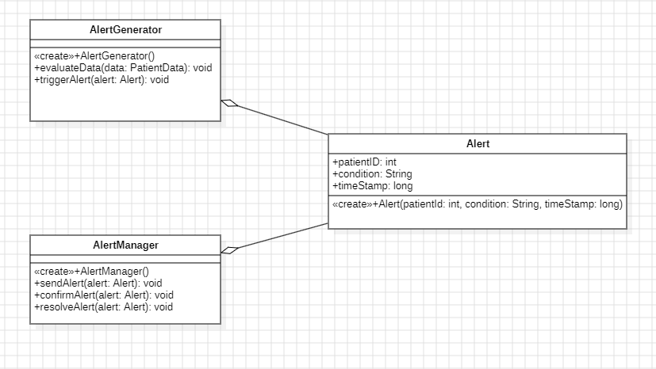
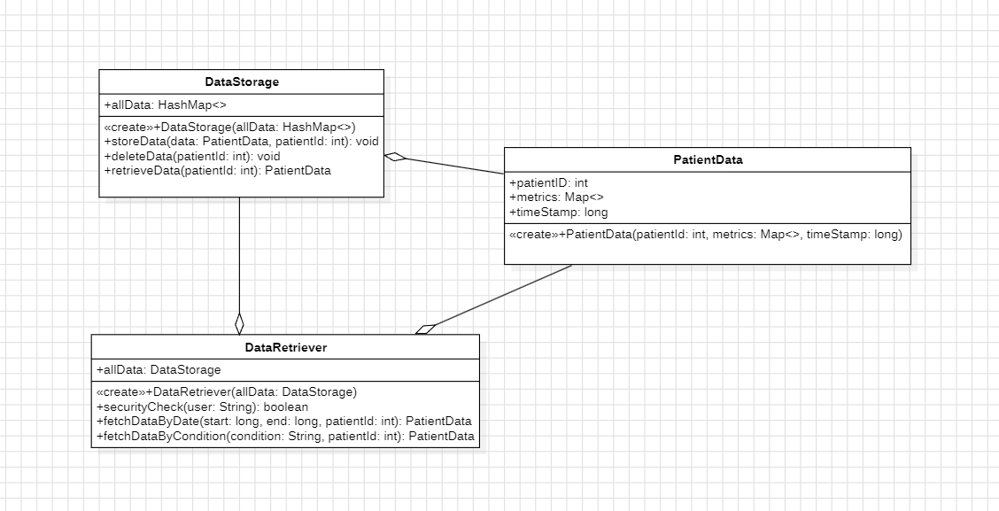
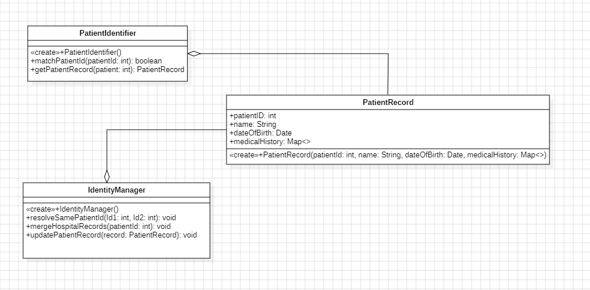
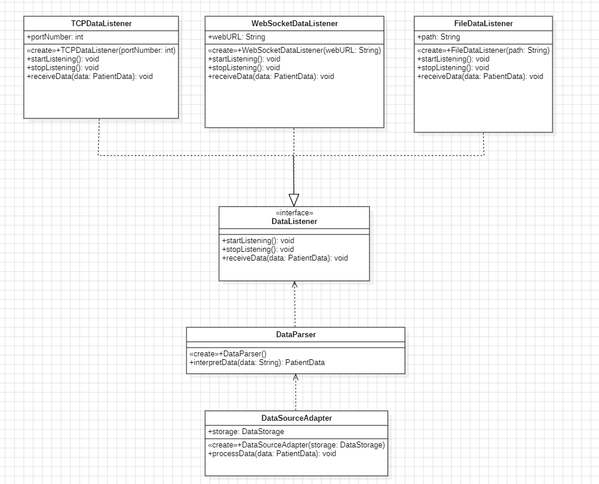

# UML Diagram Descriptions

### Alert Class Diagram

The Alert Generator Class Diagram shows the process of monitoring patient data and creating alerts based on the data read. The process begins with the AlertGenerator class constantly receiving data from the devices being used (heart rate, blood pressure, etc.) and then evaluating if the data meets a critical threshold. Each threshold is personalized for each patient based on their past trends of data. A patient can have a critical threshold for a BPM > 130 but another can have a different threshold for BPM. If the threshold is met, the Alert Generator triggers an alert by instantiating an Alert object that has the patient's ID, condition, and time of the alert. The alert is then passed to the AlertManager class for further processing and updating. The AlertManager class sends the alert to the medical staff that need to deal with that given alert. The medical staff can then confirm the receiving of the alert, or the alert automatically resolves if the value(BPM, BP, etc.) goes back below the threshold. The AlertManager class also keeps track of the alerts that have been sent and the ones that have been resolved. 

### Data Storage Class Diagram

The Data Storage Class Diagram shows the process of storing patient, retrieving, and managing patient data in the system. The process starts with the putting data for a patient into a PatientData object. This object takes in a patient's ID, all their metrics like heart rate, blood pressure, respiratory rate, oxygen saturation, etc., and the time the data was read and taken. Using the PatientData object, the DataStorage class can store the data in a database. The DataStorage class can be used to delete data as well given a patient ID. The storing of the data also needs the patient ID. All the data is stored in a Hash Map for easy access with each key corresponding to a time stamp of the patient's data. To retrieve the data based on certain parameters, the DataRetriever class can be used. The DataRetriever class can retrieve data based on the patient's ID, the time the data was taken(time A to time B), the type of data(heart rate, blood pressure,etc.), and the range of data(BPM A to BPM B). There is a security system in place to ensure that only authorized personnel can access the data. If that check is not passed, the data cannot be retrieved. This ensures only those that have authorization can access this confidential data.

### Patient Identifier Class Diagram

The Patient Identifier Class Diagram shows the method of identifying patients within the system and grabbing their given records. It starts with creating a PatientRecord object that stores all the patient's information like their full name, the hospital patient ID, date of birth, and their medical history. The medical history is stored in a map with each key representing the data type and value being the value of the data type. The Patient Record can be retrieved using the PatientIdentifier class. All that is needed to retrieve the record is the patient's ID. If there is a conflict in the records, the IdentityManager class is used to fix the issues. For example, if two patients have the same ID, it will be resolved within the class. The IdentityManager class can also merge different hospital records in case of the patient going to different hospitals. Once all this is done, the patient's record is updated and stored in the system. This system ensures that all patient records are up to date and accurate and that there are no conflicts or issues within the records that may affect any data.

### Data Listener Class Diagram

The Data Listener Class Diagram shows the process of interpretting the data from different devices into readable and understandable numbers and information. The process starts from each of the listeners pointing at the DataListener interface. Each listener uses a start and stop time as timeframes to store in certain time stamps. This keeps the data organized by time and can be grouped together easily. The TCPDataListener reads data from a port and sends it to DataParser class to interpret the data into usable information. The WebSocketDataListener reads data from a specific web URL and sends it to the DataParser class to interpret the data into usable information. The FileDataListener reads data from a file and sends it to the DataParser class to interpret the data into usable information. The DataSourceAdapter class then processes the data and stores it within a DataStorage. This process ensures that data can be read from different sources and can be interpreted in order to be stored efficiently and effectively. If data was all stored in its raw form, it can be hard to read and use due to all the conflicting formats.

### Alert State Diagram

The diagram illustrates the various states the Alert system can be in. Right after initialisation the system holds in an `idle` state until the information gathered from the data meets a certain threshold, in which point a new Alert is generates. The pointer then moves to the `generated` state, where the Alert is `sent` to the medical staff, who has to `acknowledge` the Alert either manually or by retrieving patient information. Finally, the Alert is `resolved` when there is medical intervention, stable condition, or dismissal of the Alert.

### Alert Sequence Diagram

The diagram shows the sequence of events for Alert generation. The system starts by continuously receiving data from the `PatientDataSource`. The `AlertGenerator` receives historical data of the patient from the `DataStorage` by giving it the patient ID. It then checks if the current and previous data follow a certain trend that might require an Alert depending on the thresholds set by the medical staff. When this happens, `AlertGenerator` creates an `Alert` that gets pushed to the `AlertManager` which is then managed and manipulated until it finally gets sent to the `MedicalStaff` with patientID, condition of the patient, and the time of the Alert. The `MedicalStaff` then acknowledges the alert and then finally resolves the alert.