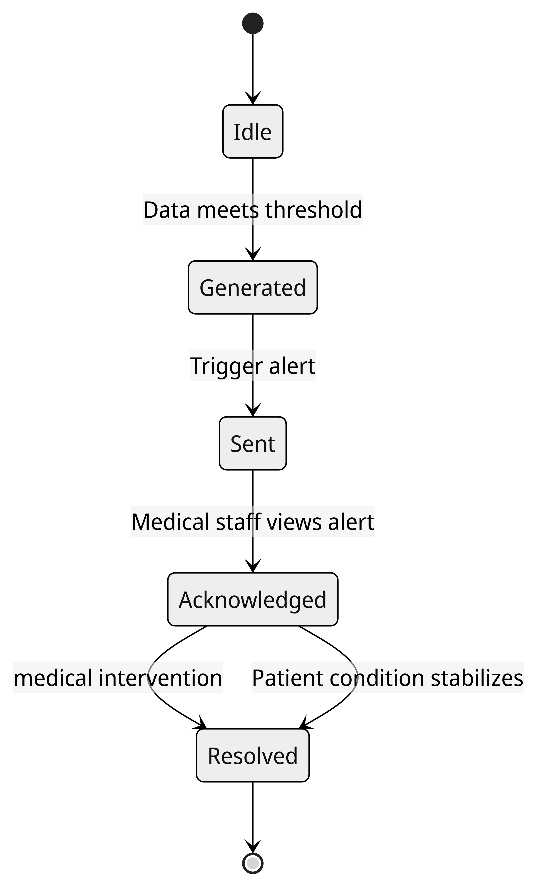
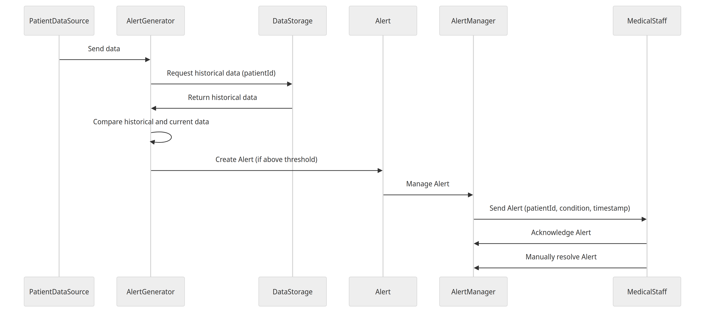

# UML Diagram Descriptions

### Alert State Diagram

The diagram illustrates the various states the Alert system can be in. Right after initialisation the system holds in an `idle` state until the information gathered from the data meets a certain threshold, in which point a new Alert is generates. The pointer then moves to the `generated` state, where the Alert is `sent` to the medical staff, who has to `acknowledge` the Alert either manually or by retrieving patient information. Finally, the Alert is `resolved` when there is medical intervention, stable condition, or dismissal of the Alert.

### Alert Sequence Diagram

The diagram shows the sequence of events for Alert generation. The system starts by continuously receiving data from the `PatientDataSource`. The `AlertGenerator` receives historical data of the patient from the `DataStorage` by giving it the patient ID. It then checks if the current and previous data follow a certain trend that might require an Alert depending on the thresholds set by the medical staff. When this happens, `AlertGenerator` creates an `Alert` that gets pushed to the `AlertManager` which is then managed and manipulated until it finally gets sent to the `MedicalStaff` with patientID, condition of the patient, and the time of the Alert. The `MedicalStaff` then acknowledges the alert and then finally resolves the alert.